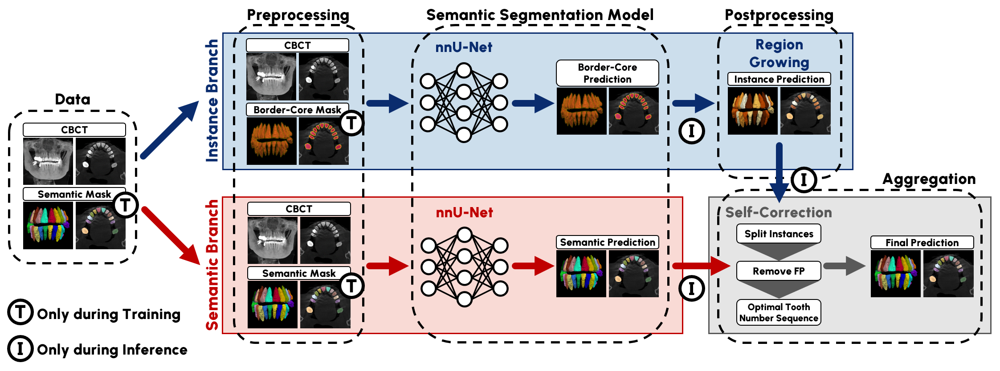

# ToothSeg: A Self-Correcting Deep Learning Approach for Robust Tooth Instance Segmentation and Numbering in CBCT

## Introduction

This is the official code of ToothSeg (Link to Paper will follow).
ToothSeg is a fully automated, dual-branch deep learning framework designed for multiclass tooth instance segmentation in CBCT scans. 
It addresses the variability in examiner diagnoses and generalization challenges across datasets by integrating instance and semantic segmentation, thus improving performance and robustness. 
The framework excels in detecting and labeling individual tooth instances across diverse dental conditions.




## Installation
All you need is a working [nnU-Net](https://github.com/MIC-DKFZ/nnUNet/tree/master) setup!
Afterward, install the ToothSeg Repository by:
```bash
pip install -e .
```


## Dataset Preparation

The goal of this stage is to prepare two datasets that fulfill the specific requirements for training the semantic and instance branches of the model.
This must also be respected if you want to train on your own data.
You need the following three datasets whereby all datasets need to be in the [nnUNet dataset format](https://github.com/MIC-DKFZ/nnUNet/blob/master/documentation/dataset_format.md):
- **Reference Dataset**: Original dataset needed as reference for resampling data to their original spacing
- **Semantic Branch**: Dataset with each tooth as a separate class and with spacing 0.3x0.3x0.3
- **Instance Branch**: Dataset in the Border-core format and spacing 0.2x0.2x0.2

### Inhouse Dataset

<details><summary>Click to expand/collapse</summary>
<p>

Since it cannot be released this code is unlikely to be useful for you, but maybe it can give some inspiration when preparing your own data.
Inhouse dataset preparation is done in [this folder](toothseg/datasets/inhouse_dataset) and the following dataset variants are created:
- **Dataset164_Filtered_Classes**: Our inhouse dataset with just the tooth labels, each image is in its original spacing (used as **Reference Data**).
- **Dataset181_CBCTTeeth_semantic_spacing03**: Dataset164 resized so that all images have spacing 0.3x0.3x0.3. Used for 
**Semantic Branch**.
- **Dataset188_CBCTTeeth_instance_spacing02_brd3px**: Dataset164 resized to spacing 0.2x0.2x0.2 and then converted to 
border-core for the **Instance Branch**.

</p>
</details>


### ToothFairy2 Dataset
<details><summary>Click to expand/collapse</summary>
<p>

ToothFairy2 dataset must be downloaded from this [website](https://ditto.ing.unimore.it/toothfairy2/). Dataset has ID 112 and is already in the nnUNet format. 
Process the Data by adapting the [toothfairy2.py](toothseg/datasets/toothfairy2/toothfairy2.py) script to your needs! The script will create three datasets:
- **Dataset121_ToothFairy2_Teeth**: Original ToothFairy Dataset but with only teeth remaining (other structures removed).ToothFairy already has all images in spacing 0.3x0.3x0.3. This is used for the **Semantic Branch**.
- Dataset122_ToothFairy2fixed_teeth_spacing02: just an intermediate dataset at spacing 0.2x0.2x0.2
- **Dataset123_ToothFairy2fixed_teeth_[dataset.json](../../../Documents/E132-Projekte/Projects/Helmholtz_Imaging_ACVL/RadboudUni_2022_ShankCBCTTeeth/dataset/nnUNetv2_raw/Dataset112_ToothFairy2/dataset.json)spacing02_brd3px**: border core representation at spacing 0.2x0.2x0.2 for the **Instance Branch**.

</p>
</details>


## Preprocessing
1. Run nnUNet's fingerprint extraction and experiment planing:
   ```bash
   # For the Inhouse Dataset
   nnUNetv2_extract_fingerprint -d 181 188 -np 64
   nnUNetv2_plan_experiment -d 181 188
   # For the ToothFairy2 Dataset
   nnUNetv2_extract_fingerprint -d 121 123 -np 64
   nnUNetv2_plan_experiment -d 121 123
   ```
2. Add this [configuration](nnUNet_plans/plans_semantic_branch.json) to your semantic segmentation branch plans (Dataset 121 and 181).
   - open `${nnUNet_preprocessed}/Dataset121_ToothFairy2_Teeth/nnUNetPlans.json` insert [this](nnUNet_plans/plans_semantic_branch.json) into the `configurations` entry (analogue for all other datasets).
3. Add this  [configuration](nnUNet_plans/plans_instance_branch.json) to your instance segmentation branch plans (Dataset 123 and 188).
   - open `${nnUNet_preprocessed}/Dataset123_ToothFairy2fixed_teeth_spacing02_brd3px/nnUNetPlans.json` insert [this](nnUNet_plans/plans_instance_branch.json) into the `configurations` entry (analogue for all other datasets).
4. Run nnUNet's preprocessing:
   ```bash
   # For the Inhouse Dataset
   nnUNetv2_preprocess -d 181 -c 3d_fullres_resample_torch_256_bs8 -np 64
   nnUNetv2_preprocess -d 188 -c 3d_fullres_resample_torch_192_bs8 -np 64
   # For the ToothFairy2 Dataset
   nnUNetv2_preprocess -d 121 -c 3d_fullres_resample_torch_256_bs8 -np 64
   nnUNetv2_preprocess -d 123 -c 3d_fullres_resample_torch_192_bs8 -np 64
   ```
   
## Training

### Inhouse dataset
The inhouse dataset is split into train and test via the imagesTr and imagesTs folders. We train on all training cases 
```bash
# semantic branch
nnUNetv2_train 181 3d_fullres_resample_torch_256_bs8 all -tr nnUNetTrainer_onlyMirror01_DASegOrd0 -num_gpus 8
# instance branch
nnUNetv2_train 188 3d_fullres_resample_torch_192_bs8 all -tr nnUNetTrainer -num_gpus 4
```

### ToothFairy2
For ToothFairy we didn't split the files into imagesTr and imagesTs because that would have interfered with other 
experiments on that datasets. Instead, we extend the nnU-Net splits_final.json file with a fifth fold that represents 
the 70:30 split used in our paper. Just copy our [splits](toothseg/datasets/toothfairy2/splits_final.json) into the 
nnUNet_preprocessed directory of Datasets 121 and 123.

```bash
# semantic branch
nnUNetv2_train 121 3d_fullres_resample_torch_256_bs8 5 -tr nnUNetTrainer_onlyMirror01_DASegOrd0 -num_gpus 4
# instance branch
nnUNetv2_train 123 3d_fullres_resample_torch_192_bs8 5 -tr nnUNetTrainer -num_gpus 4
```

*Note: we train fold 5 here, not all.*


## Inference

Inference follows the following steps. A coherent script (+optional parallelization) for our Inhouse dataset or other unseen datasets is shown in [inference_generel.sh](scripts/inference_generel.sh).
A script for inference on the Toothfairy2 dataset can be found in [inference_toothfair2.sh](scripts/inference_toothfairy2.sh).

**Note 1:** For ToothFairy2 we don't need to run test set inference. 
Since we coded the train:test split into fold 5 we can just use the predictions generated by nnU-Net in the final validation.
Don't worry about the fact that nnU-Net interprets our test set as validation set: 
nnU-Net in the setting used here does not use the validation set for anything (no epoch selection etc.) that would impact test set integrity.

**Note 2:** To limit the storage requirements, it is recommended to add `probabilities_final[probabilities_final < 1e-6] = 0` to the `export_prediction_from_logits` function in
*$CONDA_ENV/lib/python3.x/site-packages/nnunetv2/inference/export_prediction.py*, which will truncate negligible probabilities to significantly (50-100x) lower the compressed file sizes.
1. **Resize Data:** Resize the test set for the instance segmentation (border-core) prediction via 
[resize_test_set.py](toothseg/toothseg/test_set_prediction_and_eval/resize_test_set.py). **Skip for ToothFairy2!**
2. **Predict Data:** Run the predictions as you normally would with nnU-Net. **Skip for ToothFairy2!**
   - **Semantic Branch** (on original testset): Predictions will already be in the correct spacing (same as original images).
   - **Instance Branch** (on resized testset): Predictions will be in border-core format and in their 0.2x0.2x0.2 spacing --> further processing is needed
3. **Convert Instance Prediction:** Convert border-core predictions to instances with [border_core_to_instances.py](toothseg/toothseg/postprocess_predictions/border_core_to_instances.py).
4. **Resize Instance Prediction:** Resize instances to original image spacing using [resize_predictions.py](toothseg/toothseg/postprocess_predictions/resize_predictions.py).
5. **Self-correct Predictions:** Split and ignore the predicted instances and assign them the correct tooth labels (as predicted by the semantic segmentation model) with [assign_mincost_tooth_labels.py](toothseg/toothseg/postprocess_predictions/assign_mincost_tooth_labels.py)

## Evaluate test set

1. Evaluate the quality of the instances (regardless of tooth label) with [evaluate_instances.py](toothseg/evaluation/evaluate_instances.py)
2. Evaluate the quality of the predictions (instances AND correct tooth label) with [evaluate_instances_with_tooth_label.py](toothseg/evaluation/evaluate_instances_with_tooth_label.py)

Both require the final predictions of the previous stage for a full evaluation. 
Both branches can also be validated separately. 
For the evaluation of the ToothFairy Data and for inspiration on other data see [evluation_toothfairy2.sh](scripts/evaluation_toothfairy2.sh)

## Baseline methods

All baseline method implementations and corresponding documentation can be found [here](toothseg/baselines).

## Citation

```
@article{toothseg,
  title={ToothSeg: A Self-Correcting Deep Learning Approach for Robust Tooth Instance Segmentation and Numbering in CBCT}
  author={van Nistelrooij, Niels and Kr{\"a}mer, Lars and Kempers, Steven and Beyer, Michel and Ambrogioni, Luca and Bolelli, Federico and Xi, Tong and Berg{\'e}, Stefaan and Heiland, Max and Maier-Hein, Klaus H. and Vinayahalingam, Shankeeth and Isensee, Fabian},
  year={2025},
  note={Submitted to IEEE Transactions on Medical Imaging}
}
```

## Acknowledgements

<p align="left">
   &nbsp;&nbsp;&nbsp;&nbsp;
   
</p>

This Repository is developed and maintained by the Applied Computer Vision Lab (ACVL)
of [Helmholtz Imaging](https://www.helmholtz-imaging.de/).
