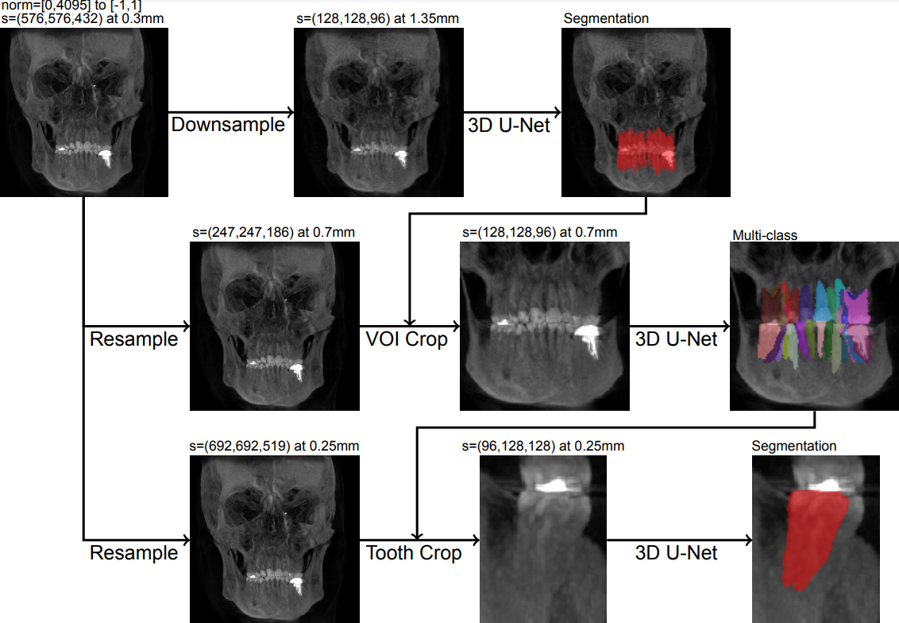
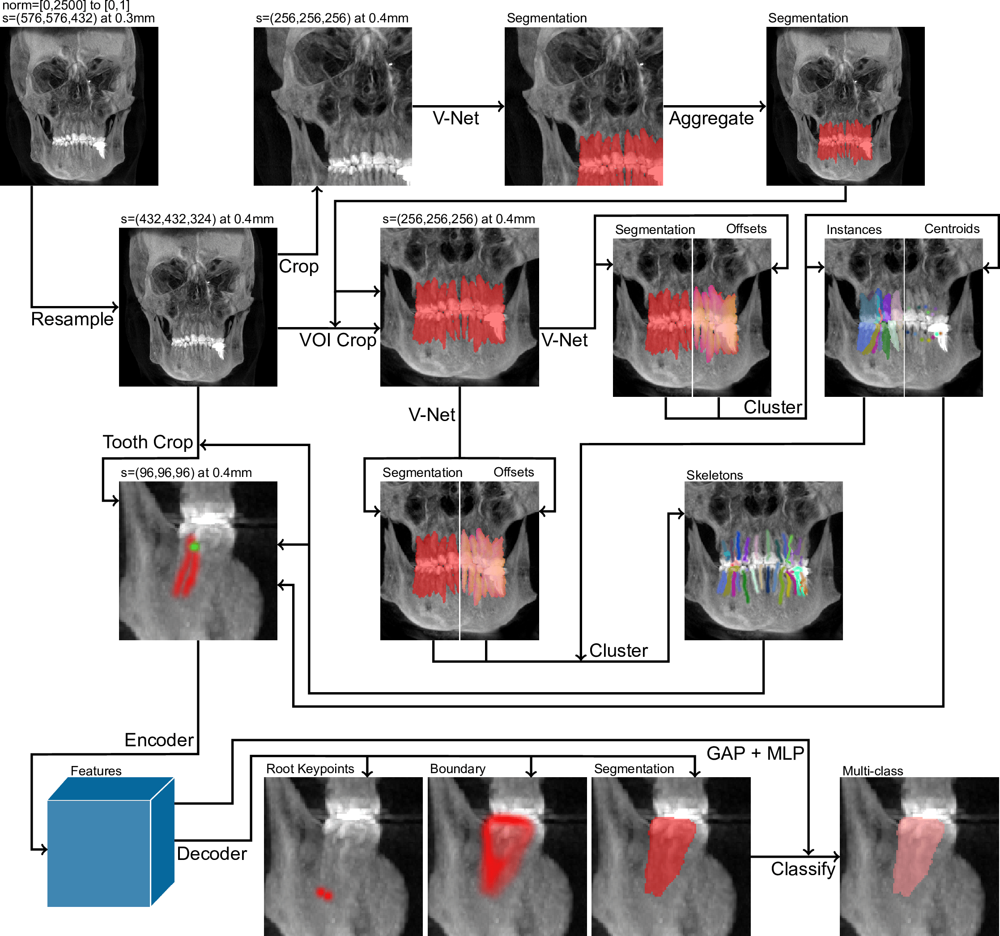
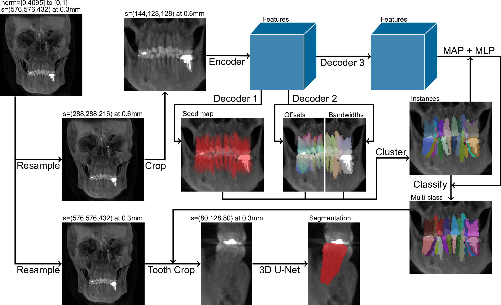
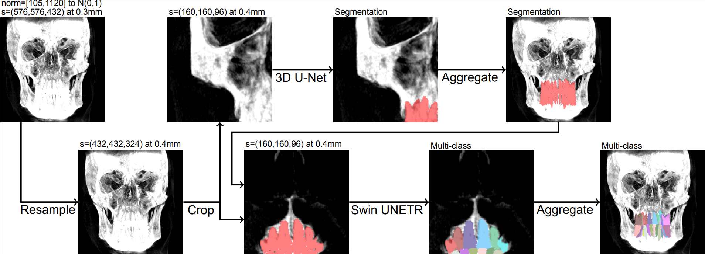

# Baseline implementations of tooth segmentation in cone-beam CT scans

This is the code repository providing implementations of four baseline methods for multi-class tooth instance segmentation in cone-beam CT scans, which we call [ReluNet](https://www.sciencedirect.com/science/article/pii/S0300571221002888), [CuiNet](https://www.nature.com/articles/s41467-022-29637-2),  [WangNet](https://www.sciencedirect.com/science/article/pii/S1361841523000117), and [LiuNet](https://www.nature.com/articles/s41368-024-00294-z).


## Baselines

### ReluNet



### CuiNet



### WangNet



### LiuNet




## Framework

The baselines are implemented with PyTorch Lightning to allow for easy use of multiple GPUs for fast training and inference.

Each baseline comes with its own configuration file (`baselines/config`), train script (`baselines/train`) and inference script (`baselines/infer`). For inference using the below provided model checkpoints, or for re-training on your own dataset, these files should be sufficient for most purposes.


## Installation

```bash
conda create -n baselines python=3.9
conda activate baselines

pip3 install torch==2.2.2 torchvision==0.17.2 torchaudio==2.2.2 --index-url https://download.pytorch.org/whl/cu118
pip3 install -r requirements.txt
```


## Inference

### Model checkpoints

Please visit [Google Drive](https://drive.google.com/drive/folders/1L3dWoCvrzDyhoxrly8H7-KIEPULxAUei?usp=sharing) to download the checkpoints.

### Configuration

You can specify your settings in the configuration file. Starting under 'datamodule', the settings below specify which scans you would like to include:

- *root*: The absolute path to your data root directory.
- *scan_dir*: The path relative to root with the scans.
- *regex_filter*: Filter the scans and segmentations using a regular expression.
- *exclude*: Filter the scans and segmentations using a list of excluded file prefixes.

The code expects to find files with the `.nii.gz` suffix in your specified scan directory and the code will save the predictions using the same file name as the scan. More settings can be configured under 'model':

- *return_type*: Whether to return FDI numbering (11-48) or ISO numbering (1-32).
- *pretrained*: Specify the path to a model checkpoint relative to the current working directory.

### Running inference

Once you have configured your settings, inference can be started using a script in the `baselines/infer` folder. Here, you should specify the final stage if possible and the number of GPUs with `--devices`. Inference will save the predictions in a folder within the root directory specified before.


## Training

### Configuration

Additional settings can be configured for training under `datamodule`:

- *seg_dir*: The path relative to root with the segmentations.
- *val_size*: The proportion of scans used for validation.
- *include_val_as_train*: Whether to include the validation scans for training to train a model on all available data.
- *test_size*: The proportion of scans used for hold-out testing.

Furthermore, each stage of a baseline has their own settings:

- *regular_spacing*: The isotropic spacing in millimeters to resample the scans, `null` means the scans are not resampled to isotropic spacing.
- *instances_dir*: The path relative to root with the instance predictions used for training the final single tooth stage for the first three baselines.
- *crop_size*: The crop size in voxels to crop the teeth ROI.
- *patch_size*: The patch size in voxels to crop around a single tooth.
- *pre_transform*: Extra transformations to perform before caching.
- *aug_transform*: Data augmentations to perform on the train data.
- *transform*: Transformations to perform after loading cached data and data augmentations.

### Running training

Once you have configured your settings, training can be started using a script in the `baselines/train` folder. Here, you can specify the stage you would like to train and the number of GPUs with `--devices`. Furthermore, you can resume a stopped training run by specifying a model checkpoint using the `--checkpoint` console argument. The data will be preprocessed during the first epoch and cached to a folder in the root directory you specified. This preprocessing can take a very long time.

All stages except the final stage can be run just from a script in `baselines/train`. However, training of the final stage depends on the predictions from the prior stages. As such, after training the prior stages, the predictions need to be determined using a script in `baselines/infer` by choosing the prior stage. These predictions will be saved to a folder within the root directory you specified. Afterward, you can select the final stage in the script in the `baselines/train` folder to continue training the final stage.


## Citation

Please include one of the following references when using a baseline from this code repository.

```
@article{relunet,
  author={Shaheen, Eman and Leite, Andr{\'{e}} and Alqahtani, Khalid Ayidh and Smolders, Andreas and Van Gerven, Adriaan and Willems, Holger and Jacobs, Reinhilde},
  year={2021},
  month={12},
  title={A novel deep learning system for multi-class tooth segmentation and classification on cone beam computed tomography. A validation study},
  journal={Journal of Dentistry},
  volume={115},
  pages={103865},
  doi={10.1016/j.jdent.2021.103865}
}
```

```
@article{cuinet,
  author={Cui, Zhiming and Fang, Yu and Mei, Lanzhuju and Zhang, Bojun and Yu, Bo and Liu, Jiameng and Jiang, Caiwen and Sun, Yuhang and Ma, Lei and Jiawei, Huang and Liu, Yang and Zhao, Yue and Lian, Chunfeng and Ding, Zhongxiang and Zhu, Min},
  year={2022},
  month={04},
  title={A fully automatic AI system for tooth and alveolar bone segmentation from cone-beam CT images},
  journal={Nature Communications},
  volume={13},
  number={1},
  pages={2096},
  doi={10.1038/s41467-022-29637-2}
}
```

```
@article{wangnet,
  author={Wang, Yiwei and Xia, Wenjun and Yan, Zhennan and Zhao, Liang and Bian, Xiaohe and Liu, Chang and Qi, Zhengnan and Zhang, Shaoting and Tang, Zisheng},
  year={2023},
  month={04},
  title={Root canal treatment planning by automatic tooth and root canal segmentation in dental CBCT with deep multi-task feature learning},
  journal={Medical Image Analysis},
  volume={85},
  pages={102750},
  doi={10.1016/j.media.2023.102750}
}
```

```
@article{liunet,
  author={Liu, Yu and Xie, Rui and Wang, Lifeng and Liu, Hongpeng and Liu, Chen and Zhao, Yimin and Bai, Shizhu and Liu, Wenyong},
  year={2024},
  month={05},
  title={Fully automatic AI segmentation of oral surgery-related tissues based on cone beam computed tomography images},
  volume={16},
  pages={34},
  doi={10.1038/s41368-024-00294-z}
}
```
